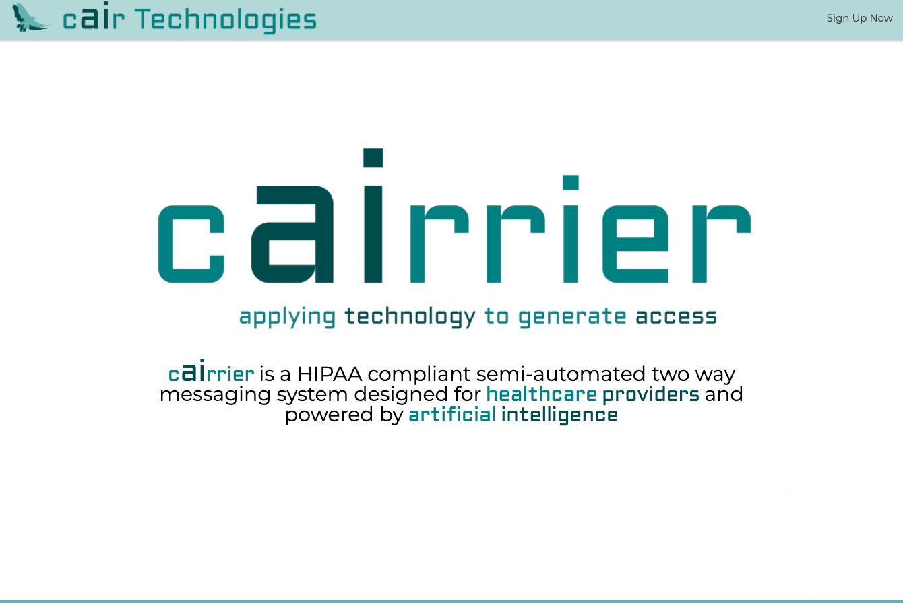
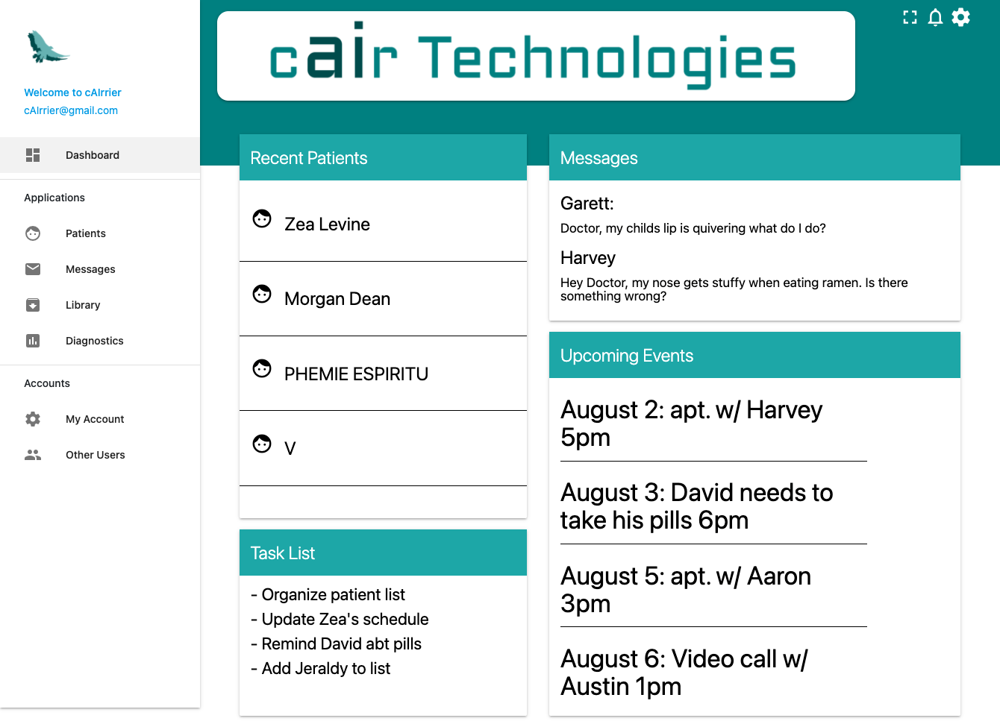
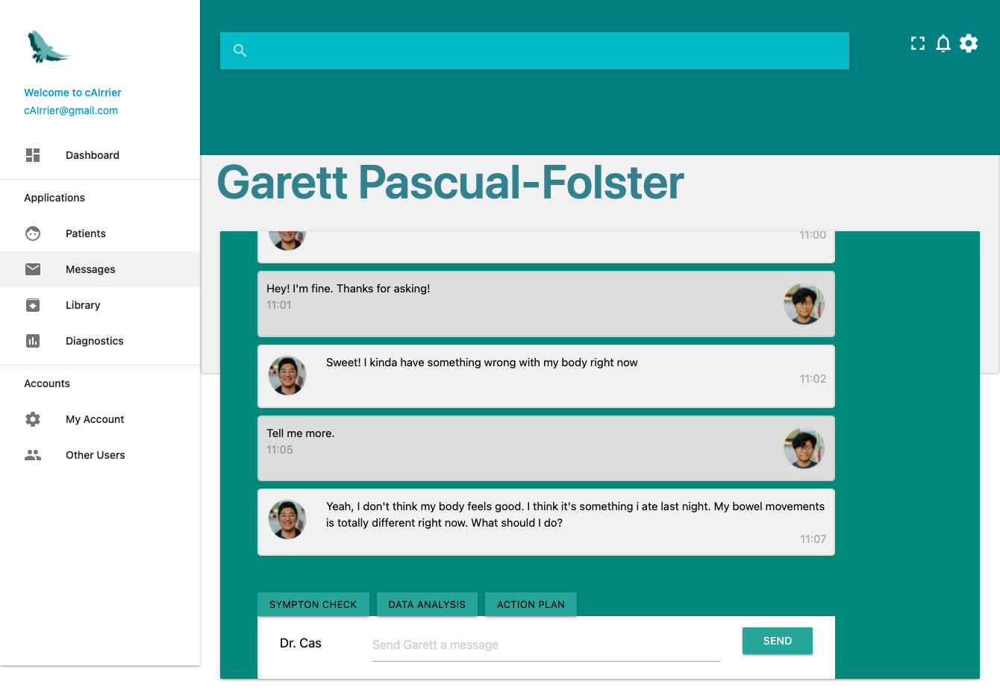
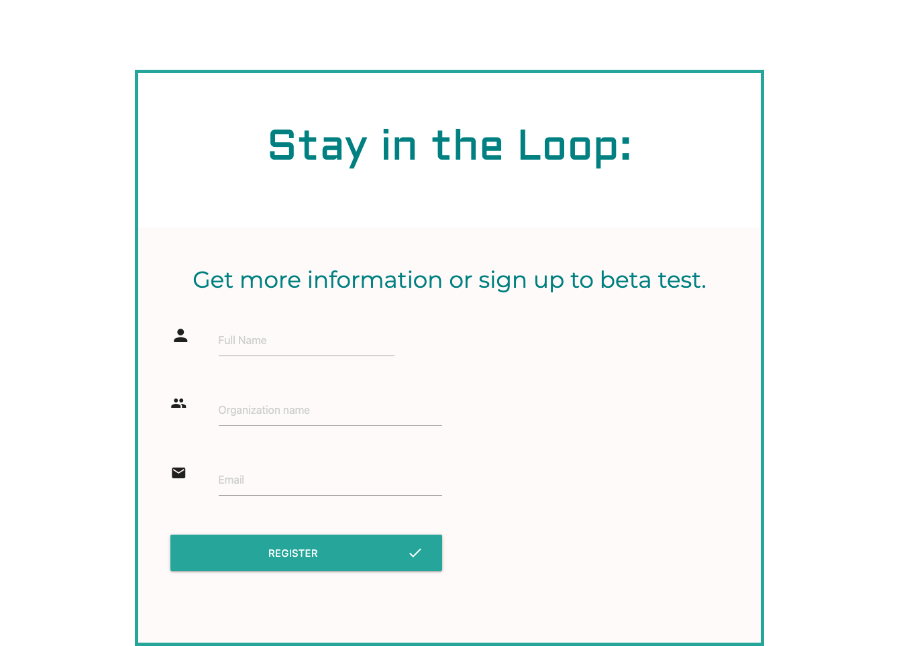

# cAIrrier

cairrier is a HIPAA compliant semi-automated two way messaging system designed for healthcare providers and powered by artificial intelligence.

Our algorithm is a semi-automated two way messaging system designed for health care workers. Our platform implements deep learning to optimize communication with patients. We believe a messaging platform should be trustworthy, intuitive, confidential, and easily customizable to meet the specific needs of your practice. Because we cair.

[Check our application!](https://cairrier.web.app/)
[View our prototype dashboard!](https://cairrier.web.app/adminPages/dashboard.html)

### Landing Page

### Sign Up Page

### Chat Page

### Email List Page

